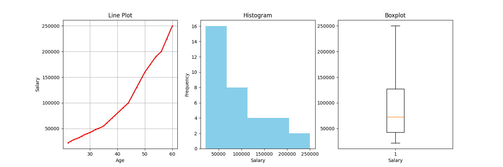

# 📊 My Matplotlib Journey

This repository is dedicated to my learning journey with **Matplotlib**, one of the most powerful and widely used Python libraries for data visualization.  

Throughout this journey, I explored **every type of graph** that Matplotlib offers, including:

- Line Plot  
- Bar Chart  
- Histogram  
- Scatter Plot  
- Pie Chart  
- Boxplot  
- Stack Plot  
- Area Plot  
- 3D Plots  
- Subplots and Multiple Graphs  

Each visualization type has its own folder/code example in this repo.  

---

## 🖼️ Example Code  

Below is one example where I created **Line Plot**, **Histogram**, and **Boxplot** in a single figure using `subplots`:

```python
import matplotlib.pyplot as plt

fig, axs = plt.subplots(1, 3, figsize=(15, 5))

# Line plot
axs[0].plot(df["Age"], df["Salary"], color="red", marker="*", linewidth=2, markersize=2)
axs[0].grid()
axs[0].set_title("Line Plot")
axs[0].set_xlabel("Age")
axs[0].set_ylabel("Salary")

# Histogram
axs[1].hist(df["Salary"], bins=5, color="skyblue")
axs[1].set_title("Histogram")
axs[1].set_xlabel("Salary")
axs[1].set_ylabel("Frequency")

# Boxplot
axs[2].boxplot(df["Salary"])
axs[2].set_title("Boxplot")
axs[2].set_xlabel("Salary")

plt.savefig("multipleplots.png")
plt.show()
```

## 📷 Screenshots  

Here are some example outputs from my Matplotlib journey:  

### Multiple Plots (Line, Histogram, Boxplot)


### Scatter Plot


### Pie Chart


